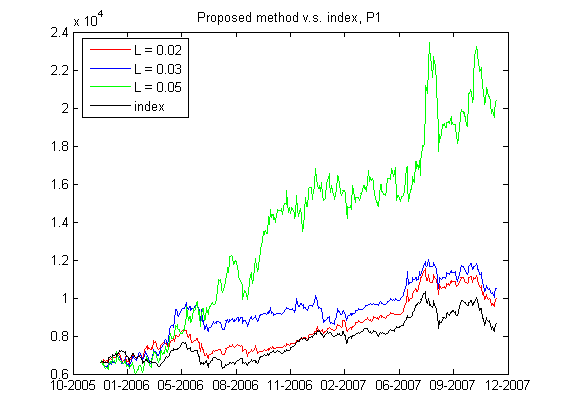

[](http://quantlet.de/index.php?p=info)

## [](http://quantlet.de/) **XFGTWSE100_strategy_fixedESlevel** [](http://quantlet.de/d3/ia)

```yaml

Name of QuantLet : XFGTWSE100_strategy_fixedESlevel

Published in : XFG (3rd Edition)

Description : 'Computes the values of the self-financing trading strategy and the FTSE TWSE Taiwan
100 Index for three different economic conditions with different fixed bounds of risk.'

Keywords : 'copula, dynamic, expected shortfall, garch, linear programming, portfolio, risk
aversion, risk measure'

Author : Shih-Feng Huang

Datafile : 'weight L=002a.xlsx, weight L=003a.xlsx, weight L=005a.xlsx, ER L002a.xlsx, ER
L003a.xlsx, ER L005a.xlsx, index 0712.csv, all 2365 empirical.csv'

Example : 'The values of the self-financing trading strategy and the FTSE, TWSE Taiwan 100 Index
with different fixed upper bounds of risk.'

```




```matlab

```
