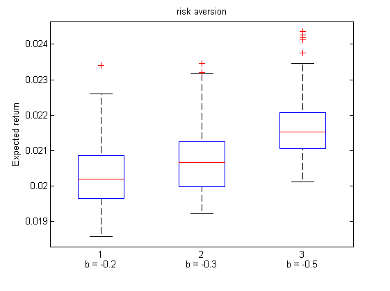

[](http://quantlet.de/index.php?p=info)

## [](http://quantlet.de/) **XFGexp_rtn_SRM** [](http://quantlet.de/d3/ia)

```yaml

Name of QuantLet : XFGexp_rtn_SRM

Published in : XFG (3rd Edition)

Description : 'Compute the optimal expected returns with a generating function of the SRM related
to the HARA utility.'

Keywords : arch, linear programming, portfolio, risk aversion, risk measure, utility

Author : Shih-Feng Huang

Datafile : None

Example : 'Boxplots of the optimal expected returns with a generating function of the SRM related
to the HARA utility, where b = -0.2, -0.3 and -0.5.'

```




```matlab

```
