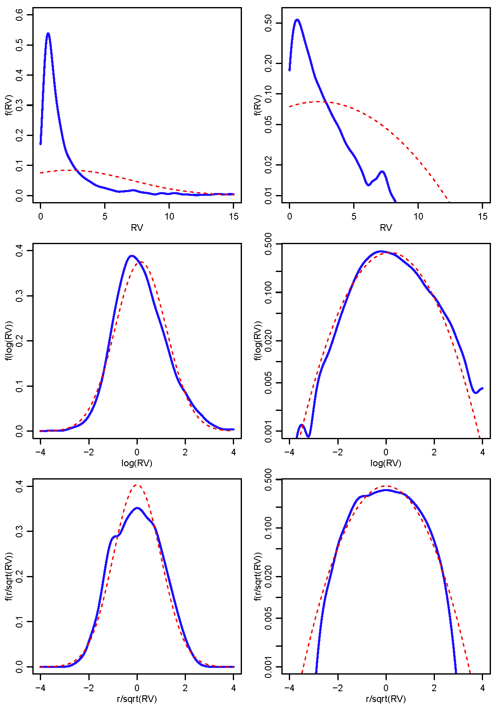

##  **XFGkernelcom**


```yaml
Name of QuantLet : XFGkernelcom

Published in : XFG_3rd Edition

Description : 'Plots kernel density estimation of the realized volatility and of correspondingly standardiyed returns for IBM, 2001-2006.
 The dotted line depicts the density of the correspondingly fitted normal distribution. The left column depicts the kernel density estimates based on a log scale.'

Keywords : 'plot, graphical representation, frequency, volatility, returns, gaussian'

See also : 

Author : Nicolas Hautsch, Uta Pigorsch

Submitted :

Datafile : ibm.dat

Example :
- 'Kernel densit estimation of reliyed volatility and of correspondingly standardiyed returns for IBM.'
```



```R
# clear history
rm(list = ls(all = TRUE))
graphics.off()

# load data
ibm = read.table("ibm.dat", header = F, col.names = c("date", "rv", "returns"))

# if save output as pdf
# pdf(file = "kernel.pdf", paper = "special", width = 6, height = 8.5)
# op = par(no.readonly = TRUE)

par(mgp = c(1.75, 0.75, 0))
par(mar = c(3, 3, 0.7, 0.7))
par(mfrow = c(3, 2))

kern = density(ibm$rv, n = 1000, from = 0, to = 15)

plot(kern$x, kern$y, type = "l", xlab = "RV", ylab = "f(RV)", lwd = 2, col = "blue", 
     ylim = c(0, 0.6))
par(new = T)
plot(kern$x, dnorm(kern$x, mean = mean(ibm$rv), sd = sd(ibm$rv)), ylab = "", xlab = "", 
     type = "l", lwd = 1, col = "red", lty = 2, ylim = c(0, 0.6))

plot(kern$x, kern$y, type = "l", xlab = "RV", ylab = "f(RV)", lwd = 2, col = "blue", 
     log = "y", ylim = c(0.01, 0.6))
par(new = T)
plot(kern$x, dnorm(kern$x, mean = mean(ibm$rv), sd = sd(ibm$rv)), ylab = "", xlab = "", 
     type = "l", log = "y", lwd = 1, col = "red", lty = 2, ylim = c(0.01, 0.6))

logKern <- density(log(ibm$rv), n = 1000, from = -4, to = 4)

plot(logKern$x, logKern$y, type = "l", xlab = "log(RV)", ylab = "f(log(RV))", lwd = 2, 
     col = "blue", ylim = c(0, 0.4))
par(new = T)
plot(logKern$x, dnorm(logKern$x, mean = mean(log(ibm$rv)), sd = sd(log(ibm$rv))), 
     ylab = "", xlab = "", type = "l", lwd = 1, col = "red", lty = 2, ylim = c(0, 
                                                                               0.4))

plot(logKern$x, logKern$y, type = "l", xlab = "log(RV)", ylab = "f(log(RV))", lwd = 2, 
     col = "blue", ylim = c(0.001, 0.4), log = "y")
par(new = T)
plot(logKern$x, dnorm(logKern$x, mean = mean(log(ibm$rv)), sd = sd(log(ibm$rv))), 
     ylab = "", xlab = "", type = "l", lwd = 1, col = "red", lty = 2, ylim = c(0.001, 
                                                                               0.4), log = "y")

stdKern = density(ibm$returns/sqrt(ibm$rv), n = 1000, from = -4, to = 4)

plot(stdKern$x, stdKern$y, type = "l", xlab = "r/sqrt(RV)", ylab = "f(r/sqrt(RV))", 
     lwd = 2, col = "blue", ylim = c(0, 0.4))
par(new = T)
plot(stdKern$x, dnorm(stdKern$x, mean = mean(ibm$returns/sqrt(ibm$rv)), sd = sd(ibm$returns/sqrt(ibm$rv))), 
     ylab = "", xlab = "", type = "l", lwd = 1, col = "red", lty = 2, ylim = c(0, 
                                                                               0.4))

plot(stdKern$x, stdKern$y, type = "l", xlab = "r/sqrt(RV)", ylab = "f(r/sqrt(RV))", 
     lwd = 2, col = "blue", ylim = c(0.001, 0.4), log = "y")
par(new = T)
plot(stdKern$x, dnorm(stdKern$x, mean = mean(ibm$returns/sqrt(ibm$rv)), sd = sd(ibm$returns/sqrt(ibm$rv))), 
     ylab = "", xlab = "", type = "l", lwd = 1, col = "red", lty = 2, ylim = c(0.001, 
                                                                               0.4), log = "y")

par(op)
dev.off() 

```
