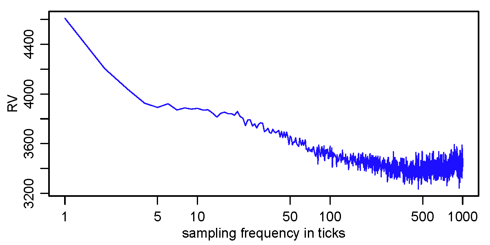

[](http://quantlet.de/index.php?p=info)

## [](http://quantlet.de/) **XFGsignature** [](http://quantlet.de/d3/ia)

```yaml

Name of QuantLet : XFGsignature

Published in : XFG (3rd Edition)

Description : 'Plots realized volatility signature for IBM, 2001-2006. Average time between trades:
6.78 seconds.'

Keywords : plot, graphical representation, frequency, volatility, sampling

Author : Nicolas Hautsch, Uta Pigorsch

Datafile : ibmsignature.dat

Example : Volatility signature plot for IBM.

```




```r
# clear history
rm(list = ls(all = TRUE))
graphics.off()

# load data
ibm = read.table("ibmSignature.dat", header = F, col.names = c("trades", "rv"))

# if save output as pdf
# pdf(file = "signature.pdf", paper = "special", width = 6, height = 3)


par(mgp = c(1.75, 0.75, 0))
par(mar = c(3, 3, 0.7, 0.7))

#Plot the volatility signature
plot(ibm$trades, ibm$rv, type = "l", xlab = "sampling frequency in ticks", ylab = "RV", 
     lwd = 1, col = "blue", log = "x")
dev.off() 


```
